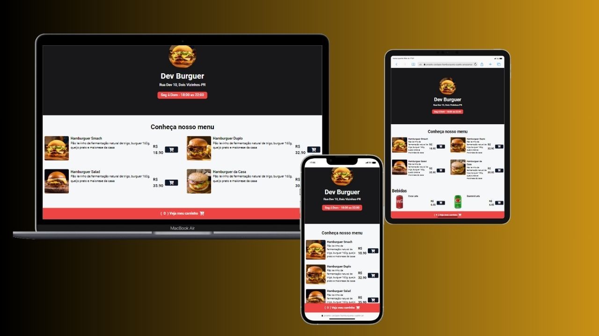

<h1>Projeto-CardapioHamburgueria-SujeitoProgramador</h1>  

Deploy do projeto:  <a href="https://projeto-cardapio-hamburgueria-sujeito-programador.vercel.app/" target="_blank">Dev Burguer</a>

Acompanhando aula no canal Sujeito Programado, projeto Hamburgueria com as funcionalidades de adicionando e removendo itens do carrinho, adicionar endereço, somando o carrinho, finalizando um pedido e enviando o pedido ao whatsapp

Foto do Projeto, totalmente responsivo:

